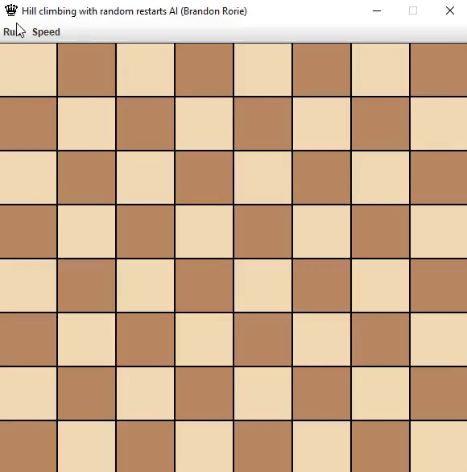

# Eight Queens Puzzle
### The eight queens puzzle is the problem of placing eight chess queens on an 8×8 chessboard so that no two queens threaten each other.

### This can be solved using a heuristical search algorithm called the hill-climbing algorithm. It is an AI designed to find a working solution in a reasonable amount of time, but not always the optimal solution. 

### This solution to the Eight Queens puzzle uses the hill-climbing algorithm with random restarts - meaning when a better heuristic cannot be calculated the queens are repositioned in random places and the algorithm restarts.

